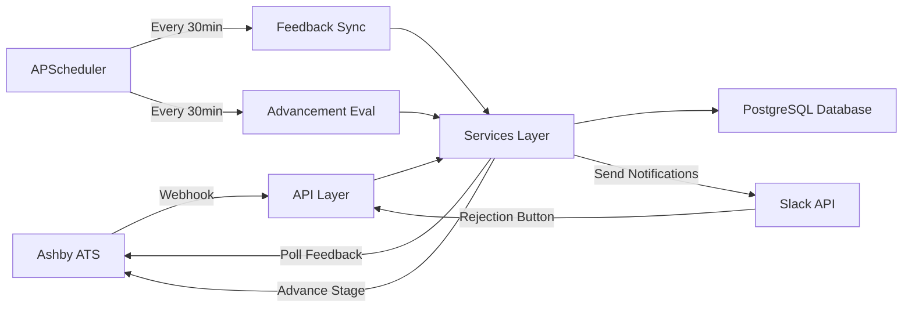

# Architecture Documentation

## Overview

Ashby Auto-Advance is built with clean architecture principles, emphasizing separation of concerns, testability, and maintainability. The application follows a layered architecture where each layer has a single, well-defined responsibility.

## System Architecture



## Layer Responsibilities

### `/api/` - HTTP Handlers

Purpose: Receive HTTP requests, validate inputs, call services, return responses

Responsibilities:
- FastAPI route handlers
- Request validation (Pydantic models)
- Authentication/authorization checks
- HTTP-specific error handling
- Rate limiting

Files:
- `webhooks.py` - Ashby webhook endpoint with signature verification
- `slack_interactions.py` - Slack interaction handlers (rejection button clicks only)
- `admin.py` - Admin endpoints for manual sync triggers, stats, and advancement testing

What it does NOT do:
- Business logic
- Direct database access
- External API calls
- View formatting

### `/clients/` - External API Wrappers

Purpose: Encapsulate all communication with external services

Responsibilities:
- HTTP client configuration
- API authentication setup
- Request/response marshalling
- View formatting (Slack Block Kit)
- Payload parsing

Files:
- `ashby.py` - Ashby ATS API client (fetch candidate info, poll feedback, advance stages, archive candidates)
- `slack.py` - Slack SDK wrapper (send messages, update messages)
- `slack_views.py` - Slack UI formatters (rejection notifications only)

What it does NOT do:
- Business logic
- Database access
- Calling other services

### `/services/` - Business Logic

Purpose: Orchestrate business operations, apply rules, manage state

Responsibilities:
- Business rule enforcement
- Data validation
- Database operations (direct SQL queries)
- Workflow orchestration
- Transaction management

Files:
- `interviews.py` - Interview schedule processing (webhook business logic, fetches job_id and interview_plan_id)
- `rules.py` - Rule matching and evaluation engine (finds rules, evaluates requirements, determines target stage)
- `feedback_sync.py` - Polls Ashby API for feedback submissions every 30 minutes
- `advancement.py` - Orchestrates evaluation, advancement execution, and rejection notifications
- `admin.py` - Advancement rule management and statistics
- `sync.py` - Data synchronization (forms, interviews, users)
- `metadata_sync.py` - Metadata synchronization (jobs, plans, stages for UI support)
- `metadata.py` - Metadata queries for UI dropdowns
- `scheduler.py` - APScheduler configuration and job management (9 background jobs)

What it does NOT do:
- HTTP handling
- View formatting
- Direct external API calls (uses clients)

### `/core/` - Infrastructure

Purpose: Foundational infrastructure components

Responsibilities:
- Application configuration
- Database connection management
- Logging setup

Files:
- `config.py` - Environment variable configuration (Pydantic Settings)
- `database.py` - AsyncPG connection pool management
- `logging.py` - Structured logging setup (structlog)

What it does NOT do:
- Business logic
- HTTP handling
- External API calls

### `/models/` - Data Structures

Purpose: Define data shapes and validation rules for inbound requests

Responsibilities:
- Pydantic models for request validation
- Runtime validation logic
- API request/response contracts

Files:
- `webhooks.py` - Ashby webhook payload models
- `advancement.py` - Advancement rule input/response models

What it does NOT do:
- Business logic
- Database operations
- API calls

**See also**: `/types/` for static response structures (TypedDict)

### `/types/` - Static Type Definitions

Static type definitions for external API responses using TypedDict.

Files:
- `ashby.py` - Ashby API response types (CandidateTD, FileHandleTD, EmailAddressTD, etc.)
- `slack.py` - Slack payload types (SlackUserTD, SlackButtonMetadataTD, SlackModalMetadataTD, etc.)

What it does NOT do:
- Runtime validation (use Pydantic models in `/models/` for that)
- Business logic
- API calls

Distinction from `/models/`:
- `/models/` - Runtime validation with Pydantic for inbound requests
- `/types/` - Static type hints for external API responses (no validation)

### `/utils/` - Generic Helpers

Purpose: Reusable utility functions with no business logic

Responsibilities:
- Security utilities (HMAC verification)
- Time utilities (parsing, formatting, timezone handling)
- Generic helper functions

Files:
- `security.py` - Webhook signature verification
- `time.py` - Timezone-aware timestamp parsing and formatting

What it does NOT do:
- Business logic
- Database access
- API calls

## Data Flow

### 1. Webhook Ingestion Flow

```
Ashby ATS
  → POST /webhooks/ashby (api/webhooks.py)
    → Verify HMAC signature (utils/security.py)
    → Extract schedule data
    → Call services/interviews.process_schedule_update()
      → Validate status (Scheduled/Complete/Cancelled)
      → Apply business rules (cancellation → delete)
      → Execute full-replace upsert to database
      → Fetch interview_plan_id (NEW: clients/ashby.fetch_interview_stage_info)
      → Extract job_id from first interview event (NEW)
      → Update schedule with advancement tracking fields (NEW)
      → Log webhook to audit table
  → Return 204 No Content
```

**Key decisions**:
- Signature verification happens in API layer (protocol-specific)
- Business rules (status validation) happen in service layer
- Full-replace strategy ensures idempotency
- API call to fetch interview_plan_id adds ~100-300ms latency (acceptable for MVP)

### 2. Feedback Sync Flow

```
APScheduler (every 30 minutes)
  → services/feedback_sync.sync_feedback_for_active_schedules()
    → Query interview_schedules WHERE status IN ('WaitingOnFeedback', 'Complete')
    → Get distinct application_ids
    → For each application_id:
      → Call clients/ashby.fetch_application_feedback(application_id)
      → For each feedback submission:
        → INSERT INTO feedback_submissions (ON CONFLICT DO NOTHING)
        → Set processed_for_advancement_at = NULL
    → Log sync results (applications processed, new submissions)
```

**Key decisions**:
- ON CONFLICT DO NOTHING ensures idempotency (safe to run multiple times)
- Error isolation: One application failure doesn't stop batch
- Pagination handled automatically in ashby client

### 3. Advancement Evaluation Flow

```
APScheduler (every 30 minutes)
  → services/advancement.process_advancement_evaluations()
    → Get schedules ready for evaluation:
      → Status IN ('WaitingOnFeedback', 'Complete')
      → Has interview_plan_id
      → Not evaluated recently OR updated since last eval
      → Within timeout window (7 days default)
    → For each schedule:
      → services/rules.find_matching_rule(job_id, plan_id, stage_id)
      → Query feedback_submissions for schedule
      → Check 30-minute wait period (submitted_at < NOW() - 30 min)
      → services/rules.evaluate_rule_requirements():
        → For each requirement:
          → Check interview is scheduled
          → Count assigned interviewers
          → Verify ALL interviewers submitted feedback
          → Extract score value from submitted_values JSONB
          → Compare against threshold using operator
        → ALL requirements must pass
      → If all passed:
        → services/rules.get_target_stage_for_rule()
        → clients/ashby.advance_candidate_stage() (with 3 retries, exponential backoff)
        → INSERT INTO advancement_executions (status='success')
        → UPDATE feedback_submissions.processed_for_advancement_at
        → UPDATE interview_schedules.last_evaluated_for_advancement_at
      → If failed:
        → services/advancement.send_rejection_notification()
        → INSERT INTO advancement_executions (status='rejected')
        → UPDATE interview_schedules.last_evaluated_for_advancement_at
    → Log summary statistics
```

**Key decisions**:
- Mark last_evaluated_for_advancement_at on EVERY evaluation (prevents infinite retry loops)
- Rejection notification sent on first failure (Decision B)
- 3 retries with exponential backoff (2s, 4s, 8s delays)
- Dry-run mode skips API call but logs decision

### 4. Rejection Workflow Flow

```
Recruiter receives Slack DM
  → Message includes:
    → Candidate name and profile link
    → Feedback summary with scores
    → Button: "Archive & Send Rejection Email"
  → Recruiter clicks button
  → POST /slack/interactions (api/slack_interactions.py)
    → Verify Slack signature
    → Parse button metadata (application_id)
    → Call services/advancement.execute_rejection()
      → clients/ashby.archive_candidate(application_id, DEFAULT_ARCHIVE_REASON_ID)
      → INSERT INTO advancement_executions (status='rejected', executed_by='recruiter_manual')
    → clients/slack.chat_update() - Update message to show "Rejection sent"
  → Return 200 OK
```

**Key decisions**:
- Archive reason from environment variable (Decision A: DEFAULT_ARCHIVE_REASON_ID)
- Confirmation dialog prevents accidental clicks
- Message update provides immediate feedback
- Communication template optional for MVP (can add later)

## Database Schema

### Core Tables

**`interview_schedules`** (Modified)
- Primary webhook ingestion table
- Stores schedule-level metadata
- Links to events via schedule_id
- **NEW**: `job_id` - Extracted from first interview event
- **NEW**: `interview_plan_id` - Fetched via interviewStage.info API
- **NEW**: `last_evaluated_for_advancement_at` - Tracks evaluation attempts

**`interview_events`**
- Individual interview events
- Contains timing, location, meeting links
- Links to interviewer assignments

**`interview_assignments`**
- Many-to-many: events ↔ interviewers
- Stores interviewer metadata
- Used for feedback counting in advancement evaluation

**`advancement_rules`** (New)
- Rule configuration for advancement
- Matches on job_id + interview_plan_id + interview_stage_id
- Specifies target_stage_id (or null for sequential)
- Can be enabled/disabled via is_active flag

**`advancement_rule_requirements`** (New)
- Score thresholds for each rule
- Specifies interview_id, score_field_path, operator, threshold_value
- is_required flag for optional interviews
- All requirements must pass for advancement

**`advancement_rule_actions`** (New)
- Actions to execute when rule passes/fails
- Currently supports: advance_stage, send_rejection_notification
- Configurable execution_order for multiple actions

**`feedback_submissions`** (New)
- Stores feedback synced from Ashby API
- Links to event_id and application_id
- Contains full submitted_values JSONB
- processed_for_advancement_at tracks if used in evaluation

**`advancement_executions`** (New)
- Complete audit trail of all advancement decisions
- Records success/failed/dry_run/rejected status
- Stores evaluation_results JSONB for debugging
- Links to schedule_id, application_id, and rule_id

### Deprecated Tables

**`feedback_reminders_sent`** (Deprecated - kept for backward compatibility)
- No longer actively used
- Can be dropped after confirming no rollback needed

**`feedback_drafts`** (Deprecated - kept for backward compatibility)
- No longer actively used
- Can be dropped after confirming no rollback needed

### Reference Tables

**`interviews`**
- Interview type definitions
- Links to feedback form definitions
- Synced from Ashby API every 12 hours

**`feedback_form_definitions`**
- Ashby feedback form schemas
- Used to extract score fields for rules
- Synced from Ashby API every 6 hours

**`slack_users`**
- Email → Slack user ID mapping
- Synced from Slack API every 12 hours
- Required for sending DMs

**`jobs`** (v2.1)
- Job metadata cache for UI dropdowns
- Synced from Ashby API every 6 hours
- Includes title, status, department, location

**`interview_plans`** (v2.1)
- Interview plan metadata cache
- Synced from Ashby API every 6 hours

**`job_interview_plans`** (v2.1)
- Many-to-many relationship between jobs and plans
- Tracks is_default flag

**`interview_stages`** (v2.1)
- Interview stage metadata cache
- Synced from Ashby API every 6 hours
- Ordered by orderInInterviewPlan

## Design Principles

### 1. Type Safety Strategy

External API responses are typed using `TypedDict` at client boundaries:

**Directory structure:**
- `app/types/ashby.py` - Ashby API response types
- `app/types/slack.py` - Slack payload types
- `app/models/` - Pydantic models for request validation

**Distinction:**
- `/models/` handles **runtime validation** (Pydantic for API requests)
- `/types/` handles **static structures** (TypedDict for API responses)

**Pattern:**
1. Define TypedDict for fields actually used
2. Cast once at the adapter boundary (in `clients/`)
3. Consume typed results everywhere else (no `dict[str, Any]` propagation)

This provides type safety without heavy model frameworks, while keeping the system pragmatic for working with dynamic external APIs.

**Enforcement:**
All architectural patterns must be reflected in this document before merge.

### Type Safety Implementation Details

**DateTime Handling:**
- `InterviewDataTD` uses `datetime` objects internally
- `slack_views.py` converts datetime → Slack format strings at the boundary using `format_slack_timestamp()`
- `utils/time.py` provides timezone-aware utilities for consistent formatting
- All timestamps from PostgreSQL TIMESTAMPTZ are timezone-aware by default
- Database stores all timestamps in UTC; Slack displays in user's local timezone

**Slack Block Kit:**
- Core block types (`SlackSectionTD`, `SlackDividerTD`, `SlackActionsTD`, `SlackContextTD`) defined in `/types/slack.py`
- Union type `SlackBlockTD` covers the block types actually used in the application
- Complex nested structures (button elements, modal internals) remain `dict[str, Any]` (pragmatic 80/20 trade-off)
- Block structure validated via contract tests rather than exhaustive typing
- Full typing would require 50+ nested TypedDicts with minimal benefit

**Ashby API Response Types** (v2.0):
- `FeedbackSubmissionTD` - Response from `applicationFeedback.list` endpoint
- `InterviewStageTD` - Response from `interviewStage.info` endpoint
- `ApplicationChangeStageResponseTD` - Response from `application.changeStage` endpoint
- All typed at client boundary in `clients/ashby.py` using `cast()`

**External SDK Stubs:**
- Type stubs created for `slack_sdk` in `/stubs/slack_sdk/web/async_client.pyi`
- Enables strict type checking without upstream type support
- Follows same pattern as existing stubs for `asyncpg`, `apscheduler`, `slowapi`
- Configured in `pyproject.toml` via `stubPath = "stubs"`

### 2. Separation of Concerns

Each layer has a single, well-defined purpose:
- API layer: HTTP protocol handling
- Services layer: Business logic
- Clients layer: External API communication

**Anti-pattern**: Business logic in API handlers
**Correct pattern**: API extracts data → Services apply logic → Clients communicate

### 2. Dependency Direction

```
api → services → clients
api → clients
  ↓      ↓         ↓
       core
```

Allowed:
- Services call clients
- API calls services
- API calls clients
- Everything can use core

Forbidden:
- Clients call services
- Core calls anything
- Circular dependencies

### 3. Idempotency

All operations must be safely repeatable:

Webhooks: Full-replace upsert strategy
- DELETE + INSERT instead of UPDATE
- Duplicate webhooks result in same final state

Reminders: Claim-before-send pattern
- INSERT INTO feedback_reminders_sent BEFORE sending
- Unique constraint prevents duplicates

Submissions: Ashby API handles idempotency
- Safe to retry on network failure

### 4. Timezone Awareness

All timestamps are UTC-aware:

Storage: PostgreSQL `TIMESTAMPTZ` (UTC)
Internal: Python `datetime` with `tzinfo=UTC`
External:
- Ashby API: ISO 8601 with 'Z' suffix
- Slack: Unix timestamps (auto-converted to user's timezone)

Utilities: `utils/time.py` provides:
- `parse_ashby_timestamp()` - ISO 8601 → datetime
- `format_slack_timestamp()` - datetime → Slack format
- `ensure_utc()` - Enforce timezone awareness
- `is_stale()` - Check data freshness

### 5. Structured Logging

All log events use structured logging with `structlog`:

```python
logger.info(
    "event_name",
    key1=value1,
    key2=value2,
    context="additional_info"
)
```

Benefits:
- Machine-parseable logs
- Easy filtering/aggregation
- Consistent format across application

## Security

### Webhook Verification

Ashby: HMAC-SHA256 signature verification
- Header: `x-ashby-signature: sha256=<hex_digest>`
- Prevents webhook spoofing
- Timing-safe comparison to prevent timing attacks

Slack: SDK handles signature verification
- Uses Slack signing secret
- Validates request timestamp (prevents replay attacks)

### Rate Limiting

**SlowAPI** integration:
- 100 requests/minute per IP for webhooks
- Prevents abuse and DoS
- Returns 429 Too Many Requests on limit exceed

### SQL Injection Prevention

**Parameterized queries** everywhere:
```python
await db.execute(
    "INSERT INTO table (col) VALUES ($1)",
    value  # Properly escaped by asyncpg
)
```

**Never** use f-strings for SQL construction

## Performance Considerations

### Connection Pooling

**AsyncPG connection pool**:
- Min size: 2 connections
- Max size: 10 connections
- Reuses connections across requests
- Automatic cleanup on shutdown

### Query Optimization

**Indexes** on:
- Foreign keys (schedule_id, event_id)
- Query filters (email, start_time)
- Sort columns (received_at DESC)

**Partial indexes** for common filters:
- Active feedback forms (WHERE NOT is_archived)
- Pending reminders (WHERE submitted_at IS NULL)

### Background Processing

**APScheduler** (9 jobs):
- Feedback sync: Every 30 minutes (polls Ashby API for new submissions)
- Advancement evaluations: Every 30 minutes (evaluates schedules and advances candidates)
- Refetch advancement fields: Every hour (backfills missing job_id/plan_id)
- Form sync: Every 6 hours (feedback form definitions)
- Interview sync: Every 12 hours (interview definitions)
- Slack user sync: Every 12 hours (email to user ID mapping)
- Jobs sync: Every 6 hours (job metadata for UI)
- Interview plans sync: Every 6 hours (plan metadata for UI)
- Interview stages sync: Every 6 hours (stage metadata for UI)

## Testing Strategy

### Unit Tests

Focus: Pure functions and utilities
- `test_security.py` - HMAC verification, timing attacks
- `test_time_utils.py` - Timezone handling, parsing, formatting
- `test_rules.py` - Rule matching, requirement evaluation, score comparison
- `test_advancement.py` - Advancement service logic
- `test_slack_views.py` - Rejection notification builder

Characteristics:
- Fast (<1ms per test)
- No external dependencies
- High coverage of edge cases

### Integration Tests

Focus: Database operations and workflows
- `test_webhook_flow.py` - Webhook → DB with real database
- `test_advancement_flow.py` - Full advancement workflow (rule matching, evaluation, execution)
- `test_feedback_sync.py` - Feedback polling from Ashby API

Characteristics:
- Use real test database
- Test database transactions
- Cover realistic edge cases (cancellations, reschedules, missing data, multiple interviewers)

### Contract Tests

Focus: External payload validation
- `test_webhook_payloads.py` - Validate Ashby webhook structure
- `test_slack_payloads.py` - Validate Slack interaction structure

Characteristics:
- Verify payload shapes match expectations
- Catch breaking API changes early
- Document expected formats

## Deployment Considerations

### Environment Variables

All configuration via environment variables (12-factor app):
- No hardcoded secrets
- Easy to change per environment
- Validated at startup (Pydantic Settings)

### Database Migrations

Current: Schema in `database/schema.sql`
Future: Consider Alembic for version control

Migration tracking:
- `schema_migrations` table records applied migrations
- Supports rollback and audit trail

### Health Checks

**`GET /health`** endpoint provides:
- Database connectivity status
- Connection pool statistics (size, free, in_use)
- Used by orchestrators (Kubernetes, Render, Railway)

### Graceful Shutdown

Startup:
1. Connect to database
2. Setup and start scheduler
3. Run initial syncs (forms, interviews, users)

Shutdown:
1. Stop scheduler (completes running jobs)
2. Disconnect database (closes pool)
3. FastAPI handles request draining

## Future Enhancements

### Potential Improvements

1. **Repository Pattern**: Abstract database operations
   - Currently: Direct SQL in services
   - Future: `repositories/interviews.py`, `repositories/feedback.py`
   - Benefits: Easier to test, swap databases

2. **Event Sourcing**: Audit trail for all changes
   - Store all state transitions
   - Replay events for debugging
   - Support analytics

3. **Message Queue**: Decouple webhook processing
   - Use Redis/RabbitMQ for async processing
   - Improves webhook response time
   - Better failure handling

4. **Caching**: Reduce database load
   - Cache feedback form definitions (already implicit)
   - Cache Slack user lookups
   - Use Redis for distributed cache

5. **Metrics**: Observability improvements
   - Prometheus metrics (requests, durations, errors)
   - Grafana dashboards
   - Alerting on anomalies

6. **Rule UI Builder**: Web interface for non-technical users
   - Visual rule creation without API calls
   - Score threshold recommendations based on historical data
   - Rule effectiveness analytics

7. **ML Threshold Optimization**: Data-driven threshold suggestions
   - Analyze historical advancement outcomes
   - Recommend optimal thresholds per role/interview
   - A/B testing for rule effectiveness

8. **Multi-Stage Advancement Chains**: Complex workflows
   - Conditional logic (if score X then skip stage Y)
   - Parallel interview paths
   - Custom advancement criteria beyond scores

9. **Approval Workflows**: Human-in-the-loop for edge cases
   - Slack approval for borderline candidates
   - Manager override capability
   - Configurable approval chains

### Scalability

**Current limitations**:
- Single-instance scheduler (no distributed lock)
- Advancement evaluation is sequential (not parallelized)

**Scaling strategy**:
1. Horizontal scaling: Multiple API instances (stateless)
2. Scheduler: Use distributed lock (Redis/PostgreSQL advisory locks)
3. Evaluations: Parallel processing with connection pool for high volume

## Conclusion

This architecture balances pragmatism with best practices:
- Clean separation of concerns enables easy maintenance
- Layered design supports testing at each level
- Idempotency and timezone handling prevent common bugs
- Structured logging aids debugging and monitoring

The codebase is designed for a team to understand quickly and extend confidently.

